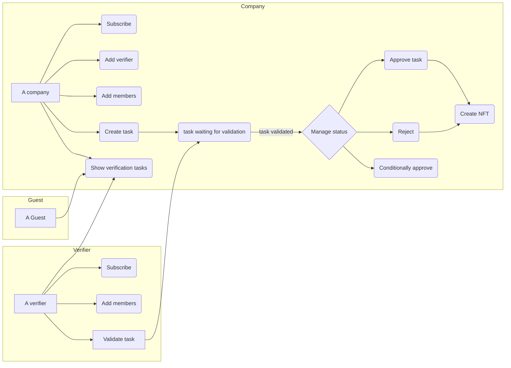

# dApp - Security register V.2

A decentralized application (dApp) or web3 application that uses blockchain technology to record the security checks that a company must carry out in order to prove the security of its buildings.

This app is intended to be used for **educational** and **informational** purposes.

You can access to a demo: 

> [Vercel security register v2](https://alyra-registre-securite-v2.vercel.app/)


## What is a security register ?

All employers must ensure the occupational safety and health of their employees (Art. L4121-1 of the French labor code).

The employer must guarantee that the building welcoming workers (ERT) and the public (ERP) complies with safety standards.

The employer must carry out periodic general checks (VGP) on any equipment that could present a danger in the event of a malfunction (heating, electricity, etc.) and on fire-fighting means (fire extinguisher, fire alarm, smoke extraction, etc.) .

Periodic general checks (VGP) are noted in a register which must be available in any ERT or ERP building.

It is called **Security (or Safety) Register** and is binding in the event of an incident (fire, accident, occupational illness, etc.)

The **Security Register** is most often a paper document.

There are digital versions whose information is centralized. This application takes advantage of the **decentralization** of. **blockchain** technology.


## How does it work ?

1. A company
   1. subscribe by registering its company
   2. add sites 
   3. add a verifier 
   4. manage user accounts
   5. create verification tasks
   6. manage verification tasks status
   7. show verification tasks
2. A Verifier
   1. subscribe by registering its company
   2. manage user accounts
   3. manage verification tasks status
   4. show verification tasks
3. A guest
   1. show verification tasks 


## Flow Chart


---

## 2. Technologies

This app uses **Ethereum** blockchain on the testnet network **Sepolia**.


- [NEXT.js](https://nextjs.org/)
- [Typescript](https://www.typescriptlang.org/)
- [TailwindCSS](https://tailwindcss.com/)
- [Hardhat 2.16.1](https://hardhat.org/)
- [RainbowKit](https://www.rainbowkit.com/)
- [Wagmi](https://wagmi.sh/)
- [Solidity 0.8.18](https://soliditylang.org/)
- [TheGraph & graph-client 3.0.0](https://thegraph.com/)

### Unit test coverage

```shell
-----------------------|----------|----------|----------|----------|----------------|
File                   |  % Stmts | % Branch |  % Funcs |  % Lines |Uncovered Lines |
-----------------------|----------|----------|----------|----------|----------------|
 contracts/            |      100 |    96.08 |      100 |      100 |                |
  SecurityRegister.sol |      100 |    96.08 |      100 |      100 |                |
-----------------------|----------|----------|----------|----------|----------------|
All files              |      100 |    96.08 |      100 |      100 |                |
-----------------------|----------|----------|----------|----------|----------------|
```

---

## 3. Installation

### 3.1. Prerequisite

#### 3.1.1. Backend .env file

In folder `backend`, rename `sample.env` to `.env`

This file contains the information necessary for authentication on the Sepolia test network.

- [Create an Infura API Key - INFURA](https://app.infura.io/dashboard)
- [Receive Sepolia ETH](https://www.infura.io/faucet/sepolia)


```js
INFURA_ID=<Infura API key>
SEPOLIA_PRIVATE_KEY=<your account private key >
```

#### 3.1.2. Frontend .env files 

In folder `frontend`, Rename `sample.env` to `.env.developement` and `.env.production`

- [Create a Wallet project ID - WalletConnect](https://walletconnect.com/)
- [Create a subgraph - The Graph](https://thegraph.com/)
- [Create a Pinata account - Pinata](https://app.pinata.cloud/pinmanager)


```js
NEXT_PUBLIC_CONTRACT_ADDRESS=<YOUR_SMART_CONTRACT_ADDRESS>
NEXT_PUBLIC_WALLET_CONNECT_PROJECT_ID=<YOUR_WALLET_CONNECT_PROJECT_ADDRESS>
NEXT_PUBLIC_ENABLE_TESTNETS=<true or false>
NEXT_PUBLIC_NETWORK=<hardhat or sepolia>
NEXT_PUBLIC_GENESIS_BLOCK=<GENESIS_BLOCK>
THE_GRAPH_HTTP_TRANSPORT=<The Graph>
NEXT_PUBLIC_PINATA_API_KEY=<Pinata API Key>
NEXT_PUBLIC_PINATA_SECRET_API_KEY=<Pinata private Key>
```

Enter the values ​​according to the environment:

- .env.development
  - `NEXT_PUBLIC_ENABLE_TESTNETS=true`
  - `NEXT_PUBLIC_NETWORK=hardhat`
  - `NEXT_PUBLIC_GENESIS_BLOCK=1`
- .env.production
  - `NEXT_PUBLIC_ENABLE_TESTNETS=false`
  - `NEXT_PUBLIC_NETWORK=sepolia`

### 3.2. Installing dependencies

#### 3.2.1. Backend installation

From the root folder, go to the `backend` folder and install the dependencies

```shell
cd backend
npm install
```

#### 3.2.2. Frontend installation

From the root folder, go to the `frontend` folder and install the dependencies

```shell
cd frontend
npm install
```

---

## 4. Deploy and run the project locally

### 4.1. Run the "hardhat" test network (local)

From the root folder, position yourself in the `backend` folder

```shell
cd backend
```

Open a console and run the following code to start the `hardhat` testnet:

```shell
npx hardhat node
```

> _**Important**: leave this console open_

### 4.2. Deploy the smart contract

Open a second console and run the following code to deploy the smart contract:

#### 4.2.1. Deployment on the `hardhat` network (local)

```shell
npx hardhat run --network localhost scripts/01-deploy.ts
```

#### 4.2.2. Deployment on the `sepolia` network

```shell
npx hardhat run --network sepolia scripts/01-deploy.ts
```

### 4.3. Start the dApp

From the root folder, navigate to the `frontend` folder

```shell
cd frontend
```

### 4.3.1. Start the application in the `dev` environment

```shell
npm run dev
```

### 4.3.2. Start the application in the `prod` environment

```shell
npm run build && npm run start
```

### 4.3.3. Access the app

From a web browser [http://localhost:3000](http://localhost:3000)

---

## 6. Compilation and unit testing

From the root folder, position yourself in the `backend` folder

```shell
cd backend 
```

### 6.1 Compile the smart contract

```shell
npx hardhat compile
```

### 6.2 Run unit tests

```shell
npx hardhat test
```

With coverage

```shell
npx hardhat coverage
```

Gas report

```shell
REPORT_GAS=true npx hardhat test
```

## 5. Deployment on Vercel

> Only the frontend is deployed on [Vercel](https://vercel.com/dashboard)
>
> The testnet used is Sepolia.
